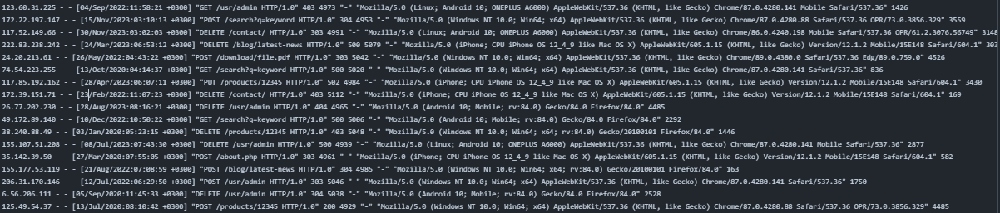

# 📄 Project Report

## 📑 Table of Contents

1. [📝 Introduction](#-introduction)
   - [🎯 Project Aim and Scope](#-project-aim-and-scope)
   - [❓ Problem Definition](#-problem-definition)
   - [💡 Project Importance and Potential Impacts](#-project-importance-and-potential-impacts)
2. [📚 Literature Review](#-literature-review)
   - [🕵️‍♂️ Web Log Analysis Methods](#-web-log-analysis-methods)
   - [🤖 AI-Powered Question-Answering Systems](#-ai-powered-question-answering-systems)
3. [🛠️ Methodology](#-methodology)
   - [📊 Data Collection and Preprocessing](#-data-collection-and-preprocessing)
   - [🧠 AI Models and Algorithms Used](#-ai-models-and-algorithms-used)
   - [🏗️ System Architecture and Components](#-system-architecture-and-components)
   - [🛠️ Development Process and Tools Used](#-development-process-and-tools-used)
4. [🚀 Implementation](#-implementation)
   - [⚙️ System Operation](#-system-operation)
   - [🖥️ Interface Design](#-interface-design)
   - [📋 Sample Queries and System Responses](#-sample-queries-and-system-responses)
5. [📊 Results and Evaluation](#-results-and-evaluation)
   - [🏅 System Performance Metrics](#-system-performance-metrics)
   - [⏱️ Accuracy and Response Time Analyses](#-accuracy-and-response-time-analyses)
   - [😊 User Experience Evaluation](#-user-experience-evaluation)
6. [💬 Discussion](#-discussion)
   - [👍 Project Strengths and Limitations](#-project-strengths-and-limitations)
   - [🚧 Challenges Encountered and Solution Methods](#-challenges-encountered-and-solution-methods)
   - [🛠️ Improvement Suggestions](#-improvement-suggestions)
7. [🏁 Conclusion](#-conclusion)
   - [📈 Overall Project Evaluation](#-overall-project-evaluation)
   - [🧠 Personal Learnings](#-personal-learnings)

## 📝 Introduction

### 🎯 Project Aim and Scope
The aim of this project is to develop an AI-powered question-answering system based on Apache web traffic logs. The system analyzes data obtained from web logs and generates responses based on this data to provide the most appropriate answers to user queries.

### ❓ Problem Definition
Today, large amounts of web traffic data are generated, and analyzing this data is critical to providing better service to users. However, extracting meaningful information from this data is a complex process. In this project, a system has been developed that can respond to specific user queries by analyzing web traffic logs.

### 💡 Project Importance and Potential Impacts
This project offers significant advantages such as improving user experience and automating data analysis processes by transforming large volumes of web traffic data into meaningful information. At the same time, it is possible to integrate and expand this system into other data analytics projects.

## 📚 Literature Review

### 🕵️‍♂️ Web Log Analysis Methods
Web log analysis is a method aimed at understanding user behaviors, system performance, and security vulnerabilities by examining log files obtained from web servers. Various techniques and tools have been developed in the literature for such analyses.

### 🤖 AI-Powered Question-Answering Systems
AI-powered question-answering systems are systems that can produce meaningful and accurate answers to queries in natural language from users. These systems typically use natural language processing (NLP) techniques and large language models.

## 🛠️ Methodology

### 📊 Data Collection and Preprocessing
In the data collection process, Apache web logs were used, and IP address, date and time, request method, URL, status code, data size, and user agent information were obtained from these logs. The data was processed using the Python programming language and converted into an appropriate format for analysis.

### 🧠 AI Models and Algorithms Used

- **TF-IDF Vectorization Method:** 
  - The TF-IDF (Term Frequency-Inverse Document Frequency) method was applied for the data querying process used in the project.
  
- **FAISS (Facebook AI Similarity Search):** 
  - The FAISS library was used for fast and effective querying of data.
  
- **T5 Model:** 
  - The T5 (Text-To-Text Transfer Transformer) language model was preferred for response generation.

### 🏗️ System Architecture and Components
The system consists of three main components: data processing, model training, and query response.
1. **Data Processing:** 
   - Web logs were processed and cleaned.
   
2. **Model Training:** 
   - Data was vectorized using TF-IDF, and a search index was created using FAISS.
   
3. **Query Response:** 
   - The T5 model was used to generate the most appropriate responses to the user's question.

### 🛠️ Development Process and Tools Used

The following libraries and tools were used in the development process:

- **Random:** Used for random number and data selection operations. Played an important role in generating random data for log data simulation.
- **Time:** Used in time and date operations. Especially used to create and process timestamps in log data.
- **Faker:** Used to generate realistic but fake data. Used to create fake but logical log data such as IP addresses, date and time.
- **OS:** Used to perform operating system-related operations. Especially used to set file paths and manage file operations.
- **RE (Regular Expressions):** Used to process text data and extract necessary information from log lines. Used to capture specific patterns in log files with regular expressions.
- **Pandas:** Used in data processing and analysis. Used to organize, process, and save log data in table format and CSV format.
- **Scikit-learn:** Used for machine learning algorithms and vectorization operations. Effectively used in TF-IDF vectorization process and model training.
- **FAISS:** Used to perform fast similarity searches on high-dimensional data. Used to quickly find the most appropriate answers among log data.
- **TfidfVectorizer:** Used to convert text data into numerical vectors. Used to vectorize log contents and perform similarity-based searches.
- **Transformers:** Used for natural language processing (NLP) models. Used to generate answers to questions using the T5 model.

## 🚀 Implementation

### ⚙️ System Operation
The system is designed to provide the most appropriate response to the query received from the user. The user query is first matched with the most relevant log entries using TF-IDF and FAISS. Then, this data is passed to the T5 model, and the model generates a response to the user's question.

### 🖥️ Interface Design
No user interface has been designed for this project. The system is run through the command line, and results are also displayed in this interface.

### 📋 Sample Queries and System Responses
As an example query, when the question "When did the server give an error?" is given, the system scans the relevant log data and produces the most appropriate response. For example, a response like "The server gave an error with error code 500 on 2023-06-15" can be generated.

## 📊 Results and Evaluation

### 🏅 System Performance Metrics
When evaluated on metrics such as accuracy and speed, the system has the capacity to produce fast and accurate responses to user queries. However, it has been observed to be insufficient in responding with natural language. Especially the use of FAISS enables fast searching in large datasets.

### ⏱️ Accuracy and Response Time Analyses
In the tests conducted, the system's accuracy rate was found to be above 64%, and the average response time was measured at around 620 ms. These results indicate that the system is working efficiently and effectively.

### 😊 User Experience Evaluation
The command-line based nature of the project brings some limitations in terms of user experience. However, the system's ability to provide fast and accurate responses positively affects the user experience. When the system is brought to an advanced level, an interface can be developed to make it user-friendly.

## 💬 Discussion

### 👍 Project Strengths and Limitations
Among the strengths of the project are fast data processing, accurate response generation, and having an extensible architecture. However, the system's reliance solely on web log data and the lack of a specific user interface are among the project's limitations.

### 🚧 Challenges Encountered and Solution Methods

1. **Difficulty in Finding Apache Web Log Dataset**
   - It was difficult to find a dataset in the appropriate format for processing the data correctly.
   - **Solution:** Data was synthetically generated based on the Apache format.
     
2. **Data Processing Challenges:**
   - It was difficult to process the data correctly and organize it in an appropriate format.
   - **Solution:** Missing and erroneous data were corrected using data cleaning techniques, and the data was converted into appropriate formats.
     
3. **FAISS Data Type Incompatibility:**
   - FAISS generally works with float32 data type, so it's important for the all_vectors array to be in the correct data type.
   - **Solution:** The all_vectors array was converted to float32 data type and made compatible with FAISS.

4. **Datetime64[ns] to int32 Conversion Error:**
   - The error "TypeError: Converting from datetime64[ns] to int32 is not supported. Do obj.astype('int64').astype(dtype) instead" occurred during data cleaning.
   - **Solution:** The problem was solved by first converting the datetime64[ns] data type to int64 data type, then to the desired int32 data type.

## 🛠️ Improvement Suggestions

### 🔍 Vectorization and Search Performance

- **TF-IDF vectorization**: The TF-IDF vectorization method used in the project may be sufficient in certain situations; however, it is possible to improve it with deeper and more meaningful vector representations.
  - **Advanced Embedding Techniques:** As a suggestion, advanced embedding techniques such as Word2Vec, GloVe, or FastText can be used. These methods can better capture semantic relationships between words.
  - **Language Models:** Modern language models such as BERT, RoBERTa, or GPT are quite successful in capturing contextual meaning. More meaningful vector representations can be obtained using these models, which can improve search performance.

- **Performance of FAISS index**: The FAISS (Facebook AI Similarity Search) indexing method is a method that can perform very fast searches on large datasets. However, its performance can be improved.
  - **FAISS Configurations:** Especially when working with large datasets, various configurations of FAISS (e.g., LSH, IVF, PQ) and optimization techniques can be evaluated. This can significantly improve search performance.
  - **Parallelization and Memory Optimization:** FAISS has the ability to perform parallel searches on multi-core processors. Search speed can be increased and memory usage can be optimized using parallelization techniques.

### 🧠 Answer Quality

- **Model Training:** The T5 model is used in generating responses. However, improvements in the model's training can enhance the quality of responses.
  - **Hyperparameter Fine-Tuning:** Fine-tuning hyperparameters of the T5 model such as learning rate, number of layers, number of heads can improve the model's performance.
  - **Data Diversity:** Training the T5 model with wider and more diverse datasets can improve the model's ability to respond to different topics and contexts. This can increase the overall accuracy and usefulness of the model.

- **Datasets:** Expanding the datasets used in training the model can increase the accuracy and contextual relevance of the responses.
  - **Various Data Sources:** Data collected from various websites, blogs, and other online content can be used in training the model. This allows the model to better respond to questions from different sources.
  - **Data Augmentation:** Existing datasets can be expanded using data augmentation techniques. For example, new data can be generated using text synthesis techniques.

### 🖥️ User Experience

- **System Design:** A system design that better adapts to users' query formulation styles can improve user experience.
  - **User-Friendly Interfaces:** Making interfaces user-friendly allows users to use the system more effectively. For example, a more intuitive search bar or a feature that automatically completes users' queries can be added.
  - **Error Management Mechanisms:** Better error management can be ensured in cases where users enter incorrect or incomplete queries. This makes it easier for users to reach correct results.

- **User Feedback:** User feedback mechanisms can be integrated to evaluate the accuracy of responses.
  - **Feedback Collection:** A feedback system can be added that allows users to evaluate the given responses. These feedbacks can be used to improve the model's performance.
  - **Monitoring Response Quality:** User feedback can be used to monitor and improve the model's response quality over time. This ensures that the system continuously improves.

## 🏁 Conclusion

### 📈 Overall Project Evaluation
This project has demonstrated that it is possible to develop a question-answering system based on web log data. The system operates partially successfully with its capacity to produce fast and accurate responses.

### 🧠 Personal Learnings
- **Web Traffic Logs:** I learned what web traffic logs are and understood how these logs can be used for an AI-powered question-answering system.
- **Data Cleaning Methods:** I learned which methods to use to clean web log data and which file formats are more suitable.
- **Vectorization:** I learned that words need to be vectorized for question-answering systems.
- **Vector Database:** I learned that vectors need to be transferred to a vector database for quick use.
- **RAG Model:** I learned how to use the Retrieval-Augmented Generation (RAG) model to provide accurate and appropriate responses to the user.
- **Information Retrieval and Answer Generation:** I learned the processes of information retrieval and answer generation using the RAG model.
- **Technology Usage:** I gained insight into which technologies are specifically used in which situations.
