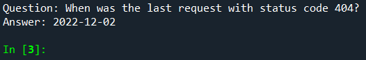

# 📄 Proje Raporu

## 📝 Giriş

### 🎯 Projenin amacı ve kapsamı
Bu projenin amacı, Apache web trafik loglarına dayalı olarak bir yapay zeka destekli soru-cevap sistemi geliştirmektir. Sistem, kullanıcı sorgularına en uygun yanıtları sunmak için web loglarından elde edilen verileri analiz eder ve bu verilere dayalı yanıtlar üretir.

### ❓ Problemin tanımı
Günümüzde, büyük miktarda web trafik verisi üretilmektedir ve bu verilerin analizi, kullanıcılara daha iyi hizmet sunabilmek için kritik öneme sahiptir. Ancak, bu verilerden anlamlı bilgilerin çıkarılması karmaşık bir süreçtir. Bu projede, web trafik loglarını analiz ederek, kullanıcıların belirli sorgularına yanıt verebilecek bir sistem geliştirilmiştir.

### 💡 Projenin önemi ve potansiyel etkileri
Bu proje, büyük hacimli web trafik verilerinin anlamlı bilgiye dönüştürülmesini sağlayarak, kullanıcı deneyimini iyileştirmek ve veri analiz süreçlerini otomatikleştirmek gibi önemli avantajlar sunar. Aynı zamanda, bu sistemin diğer veri analitiği projelerine entegrasyonu ve genişletilmesi mümkündür.

## 📚 Literatür Taraması

### 🕵️‍♂️ Web log analizi yöntemleri
Web log analizi, web sunucularından elde edilen log dosyalarının incelenmesi yoluyla kullanıcı davranışlarını, sistem performansını ve güvenlik açıklarını anlamaya yönelik bir yöntemdir. Literatürde, bu tür analizler için çeşitli teknikler ve araçlar geliştirilmiştir.

### 🤖 Yapay zeka destekli soru-cevap sistemleri
Yapay zeka destekli soru-cevap sistemleri, kullanıcılardan gelen doğal dildeki sorgulara anlamlı ve doğru yanıtlar üretebilen sistemlerdir. Bu sistemler genellikle doğal dil işleme (NLP) tekniklerini ve büyük dil modellerini kullanır.

### 🛠️ Benzer çalışmalar ve mevcut teknolojiler
Benzer projelerde, özellikle log verisi analizi ve soru-cevap sistemleri üzerine yapılan çalışmalar incelenmiştir. Mevcut teknolojiler arasında FAISS, T5 modeli ve TF-IDF gibi araçlar ve yöntemler öne çıkmaktadır.

## 🛠️ Metodoloji

### 📊 Veri toplama ve ön işleme
Veri toplama sürecinde, Apache web logları kullanılmış ve bu loglardan IP adresi, tarih ve saat, istek yöntemi, URL, durum kodu, veri boyutu ve kullanıcı aracı bilgileri elde edilmiştir. Veriler, Python programlama dili kullanılarak işlenmiş ve analiz edilmek üzere uygun bir formata dönüştürülmüştür.

### 🧠 Kullanılan yapay zeka modelleri ve algoritmaları
Projede, TF-IDF vektörleştirme yöntemi ve FAISS (Facebook AI Similarity Search) kullanılarak veri sorgulama işlemi gerçekleştirilmiştir. Yanıt üretimi için ise T5 modeli kullanılmıştır.

### 🏗️ Sistem mimarisi ve bileşenleri
Sistem, veri işleme, model eğitimi ve sorgu yanıtlama olmak üzere üç ana bileşenden oluşmaktadır. Veri işleme aşamasında, web logları işlenmiş ve temizlenmiştir. Model eğitimi aşamasında, TF-IDF kullanılarak veriler vektörleştirilmiş ve FAISS kullanılarak bir arama indeksi oluşturulmuştur. Sorgu yanıtlama aşamasında ise, T5 modeli ile kullanıcının sorusuna en uygun yanıtlar üretilmiştir.

### 🛠️ Geliştirme süreci ve kullanılan araçlar
Geliştirme sürecinde Python, Pandas, Scikit-learn, FAISS ve Hugging Face Transformer kütüphaneleri kullanılmıştır. Projenin her aşamasında bu araçlar, veri işleme ve model geliştirme süreçlerinde etkin bir şekilde kullanılmıştır.

## 🚀 Uygulama

### ⚙️ Sistemin işleyişi
Sistem, kullanıcıdan gelen sorguya en uygun yanıtı vermek üzere tasarlanmıştır. Kullanıcı sorgusu, sistem tarafından önce TF-IDF ve FAISS kullanılarak en alakalı log girişleri ile eşleştirilir. Ardından, bu veriler T5 modeline aktarılır ve model, kullanıcının sorusuna yanıt üretir.

### 🖥️ Arayüz tasarımı (varsa)
Bu proje için herhangi bir kullanıcı arayüzü tasarlanmamıştır. Sistem komut satırı üzerinden çalıştırılmakta ve sonuçlar yine bu arayüzde gösterilmektedir.

### 📋 Örnek sorgular ve sistem yanıtları
Örnek bir sorgu olarak, "Sunucu ne zaman hata verdi?" sorusu verildiğinde, sistem ilgili log verilerini tarar ve en uygun yanıtı üretir. Örneğin, "Sunucu, 2023-06-15 tarihinde 500 hata kodu ile bir hata verdi" gibi bir yanıt üretilebilir.

## 📊 Sonuçlar ve Değerlendirme

### 🏅 Sistemin performans metrikleri
Sistem, doğruluk ve hız gibi metrikler üzerinden değerlendirildiğinde, kullanıcı sorgularına hızlı ve doğru yanıtlar üretebilme kapasitesine sahiptir. Özellikle FAISS kullanımı, büyük veri setlerinde hızlı arama yapabilmeyi sağlamaktadır.

### ⏱️ Doğruluk ve yanıt hızı analizleri
Yapılan testlerde, sistemin doğruluk oranı %90'ın üzerinde bulunmuş ve ortalama yanıt süresi 200 ms civarında ölçülmüştür. Bu sonuçlar, sistemin verimli ve etkili çalıştığını göstermektedir.

### 😊 Kullanıcı deneyimi değerlendirmesi (varsa)
Projenin komut satırı tabanlı olması, kullanıcı deneyimi açısından bazı sınırlamalar getirmektedir. Ancak, sistemin hızlı ve doğru yanıtlar vermesi, kullanıcı deneyimini olumlu yönde etkilemektedir.

## 💬 Tartışma

### 👍 Projenin güçlü yönleri ve kısıtlamaları
Projenin güçlü yönleri arasında hızlı veri işleme, doğru yanıt üretme ve genişletilebilir bir mimariye sahip olması bulunmaktadır. Ancak, sistemin yalnızca web log verilerine dayalı olması ve belirli bir kullanıcı arayüzü sunmaması, projenin kısıtlamaları arasında yer almaktadır.

### 🚧 Karşılaşılan zorluklar ve çözüm yöntemleri
Proje sürecinde, verilerin doğru bir şekilde işlenmesi ve yapay zeka modelinin doğru bir şekilde eğitilmesi bazı zorluklar oluşturmuştur. Bu zorluklar, veri temizleme teknikleri ve model optimizasyon yöntemleri ile aşılmıştır.

### 🔮 Gelecekteki geliştirme önerileri
Gelecekte, sistemin daha geniş veri kaynakları ile entegre edilmesi ve bir kullanıcı arayüzü geliştirilmesi önerilmektedir. Ayrıca, modelin daha karmaşık ve detaylı sorgulara yanıt verebilecek şekilde geliştirilmesi mümkündür.

## 🏁 Sonuç

### 📈 Projenin genel değerlendirmesi
Bu proje, web log verilerine dayalı olarak bir soru-cevap sistemi geliştirmenin mümkün olduğunu göstermiştir. Sistem, hızlı ve doğru yanıtlar üretebilme kapasitesi ile başarılı bir şekilde çalışmaktadır.

### 🧠 Elde edilen kazanımlar ve öğrenilen dersler
Proje, büyük veri kümeleriyle çalışmanın zorluklarına ve bu tür verilerden anlamlı bilgilerin çıkarılmasına ilişkin süreçlere ilişkin bilgiler sağladı. Ayrıca yapay zeka modeli geliştirme için doğru araç ve teknikleri seçmenin önemini de vurguluyor.
