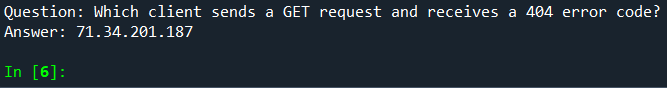
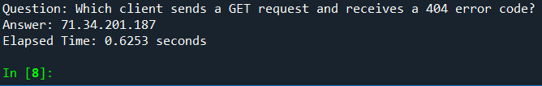
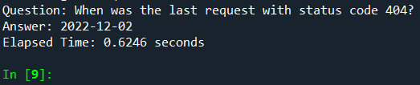

# 📄 Proje Raporu

## 📑 İçindekiler

1. [📝 Giriş](#-giriş)
   - [🎯 Projenin Amacı ve Kapsamı](#-projenin-amacı-ve-kapsamı)
   - [❓ Problemin Tanımı](#-problemin-tanımı)
   - [💡 Projenin Önemi ve Potansiyel Etkileri](#-projenin-önemi-ve-potansiyel-etkileri)
2. [📚 Literatür Taraması](#-literatür-taraması)
   - [🕵️‍♂️ Web Log Analizi Yöntemleri](#-web-log-analizi-yöntemleri)
   - [🤖 Yapay Zeka Destekli Soru-Cevap Sistemleri](#-yapay-zeka-destekli-soru-cevap-sistemleri)
   - [🛠️ Benzer Çalışmalar ve Mevcut Teknolojiler](#-benzer-çalışmalar-ve-mevcut-teknolojiler)
3. [🛠️ Metodoloji](#-metodoloji)
   - [📊 Veri Toplama ve Ön İşleme](#-veri-toplama-ve-ön-işleme)
   - [🧠 Kullanılan Yapay Zeka Modelleri ve Algoritmaları](#-kullanılan-yapay-zeka-modelleri-ve-algoritmaları)
   - [🏗️ Sistem Mimarisi ve Bileşenleri](#-sistem-mimarisi-ve-bileşenleri)
   - [🛠️ Geliştirme Süreci ve Kullanılan Araçlar](#-geliştirme-süreci-ve-kullanılan-araçlar)
4. [🚀 Uygulama](#-uygulama)
   - [⚙️ Sistemin İşleyişi](#-sistemin-işleyişi)
   - [🖥️ Arayüz Tasarımı](#-arayüz-tasarımı)
   - [📋 Örnek Sorgular ve Sistem Yanıtları](#-örnek-sorgular-ve-sistem-yanıtları)
5. [📊 Sonuçlar ve Değerlendirme](#-sonuçlar-ve-değerlendirme)
   - [🏅 Sistemin Performans Metrikleri](#-sistemin-performans-metrikleri)
   - [⏱️ Doğruluk ve Yanıt Hızı Analizleri](#-doğruluk-ve-yanıt-hızı-analizleri)
   - [😊 Kullanıcı Deneyimi Değerlendirmesi](#-kullanıcı-deneyimi-değerlendirmesi)
6. [💬 Tartışma](#-tartışma)
   - [👍 Projenin Güçlü Yönleri ve Kısıtlamaları](#-projenin-güçlü-yönleri-ve-kısıtlamaları)
   - [🚧 Karşılaşılan Zorluklar ve Çözüm Yöntemleri](#-karşılaşılan-zorluklar-ve-çözüm-yöntemleri)
   - [🛠️ İyileştirme Önerileri](#-iyileştirme-önerileri)
7. [🏁 Sonuç](#-sonuç)
   - [📈 Projenin Genel Değerlendirmesi](#-projenin-genel-değerlendirmesi)
   - [🧠 Kazanımlarım (Kişisel)](#-kazanımlarım-kişisel)

## 📝 Giriş

### 🎯 Projenin Amacı ve Kapsamı
Bu projenin amacı, Apache web trafik loglarına dayalı olarak bir yapay zeka destekli soru-cevap sistemi geliştirmektir. Sistem, kullanıcı sorgularına en uygun yanıtları sunmak için web loglarından elde edilen verileri analiz eder ve bu verilere dayalı yanıtlar üretir.

### ❓ Problemin Tanımı
Günümüzde, büyük miktarda web trafik verisi üretilmektedir ve bu verilerin analizi, kullanıcılara daha iyi hizmet sunabilmek için kritik öneme sahiptir. Ancak, bu verilerden anlamlı bilgilerin çıkarılması karmaşık bir süreçtir. Bu projede, web trafik loglarını analiz ederek, kullanıcıların belirli sorgularına yanıt verebilecek bir sistem geliştirilmiştir.

### 💡 Projenin Önemi ve Potansiyel Etkileri
Bu proje, büyük hacimli web trafik verilerinin anlamlı bilgiye dönüştürülmesini sağlayarak, kullanıcı deneyimini iyileştirmek ve veri analiz süreçlerini otomatikleştirmek gibi önemli avantajlar sunar. Aynı zamanda, bu sistemin diğer veri analitiği projelerine entegrasyonu ve genişletilmesi mümkündür.

## 📚 Literatür Taraması

### 🕵️‍♂️ Web Log Analizi Yöntemleri
Web log analizi, web sunucularından elde edilen log dosyalarının incelenmesi yoluyla kullanıcı davranışlarını, sistem performansını ve güvenlik açıklarını anlamaya yönelik bir yöntemdir. Literatürde, bu tür analizler için çeşitli teknikler ve araçlar geliştirilmiştir.

### 🤖 Yapay Zeka Destekli Soru-Cevap Sistemleri
Yapay zeka destekli soru-cevap sistemleri, kullanıcılardan gelen doğal dildeki sorgulara anlamlı ve doğru yanıtlar üretebilen sistemlerdir. Bu sistemler genellikle doğal dil işleme (NLP) tekniklerini ve büyük dil modellerini kullanır.

### 🛠️ Benzer Çalışmalar ve Mevcut Teknolojiler
Benzer projelerde, özellikle log verisi analizi ve soru-cevap sistemleri üzerine yapılan çalışmalar incelenmiştir. Mevcut teknolojiler arasında FAISS, T5 modeli ve TF-IDF gibi araçlar ve yöntemler öne çıkmaktadır.

## 🛠️ Metodoloji

### 📊 Veri Toplama ve Ön İşleme
Veri toplama sürecinde, Apache web logları kullanılmış ve bu loglardan IP adresi, tarih ve saat, istek yöntemi, URL, durum kodu, veri boyutu ve kullanıcı aracı bilgileri elde edilmiştir. Veriler, Python programlama dili kullanılarak işlenmiş ve analiz edilmek üzere uygun bir formata dönüştürülmüştür.

### 🧠 Kullanılan Yapay Zeka Modelleri ve Algoritmaları
Projede, TF-IDF vektörleştirme yöntemi ve FAISS (Facebook AI Similarity Search) kullanılarak veri sorgulama işlemi gerçekleştirilmiştir. Yanıt üretimi için ise T5 modeli kullanılmıştır.

### 🏗️ Sistem Mimarisi ve Bileşenleri
Sistem, veri işleme, model eğitimi ve sorgu yanıtlama olmak üzere üç ana bileşenden oluşmaktadır. Veri işleme aşamasında, web logları işlenmiş ve temizlenmiştir. Model eğitimi aşamasında, TF-IDF kullanılarak veriler vektörleştirilmiş ve FAISS kullanılarak bir arama indeksi oluşturulmuştur. Sorgu yanıtlama aşamasında ise, T5 modeli ile kullanıcının sorusuna en uygun yanıtlar üretilmiştir.

### 🛠️ Geliştirme Süreci ve Kullanılan Araçlar

Geliştirme sürecinde aşağıdaki kütüphaneler ve araçlar kullanılmıştır:

- **Random:** Rastgele sayı ve veri seçimi işlemleri için kullanıldı. Log verilerinin simülasyonunda rastgele veri üretmek için önemli bir rol oynadı.
- **Time:** Zaman ve tarih işlemlerinde kullanıldı. Özellikle log verilerindeki zaman damgalarını oluşturmak ve işlemek için kullanıldı.
- **Faker:** Gerçekçi fakat sahte veri üretmek için kullanıldı. IP adresleri, tarih ve saat gibi log verilerinin sahte fakat mantıklı bir şekilde oluşturulması için kullanıldı.
- **OS:** İşletim sistemi ile ilgili işlemleri gerçekleştirmek için kullanıldı. Özellikle dosya yolunu ayarlamak ve dosya işlemlerini yönetmek için kullanıldı.
- **RE (Regular Expressions):** Metin verilerini işlemek ve gerekli bilgileri log satırlarından çıkarmak için kullanıldı. Düzenli ifadelerle log dosyalarındaki belirli desenleri yakalamak için kullanıldı.
- **Pandas:** Veri işleme ve analizinde kullanıldı. Log verilerini tablo formatında düzenlemek, işlemek ve CSV formatında kaydetmek için kullanıldı.
- **Scikit-learn:** Makine öğrenimi algoritmaları ve vektörleştirme işlemleri için kullanıldı. TF-IDF vektörleştirme işlemi ve model eğitiminde etkin bir şekilde kullanıldı.
- **FAISS:** Yüksek boyutlu veriler üzerinde hızlı benzerlik aramaları yapmak için kullanıldı. Log verileri arasında en uygun cevapları hızlı bir şekilde bulmak için kullanıldı.
- **TfidfVectorizer:** Metin verilerini sayısal vektörlere dönüştürmek için kullanıldı. Log içeriklerini vektörleştirmek ve benzerlik bazlı aramalar yapmak için kullanıldı.
- **Transformers:** Doğal dil işleme (NLP) modelleri için kullanıldı. T5 modelini kullanarak sorulara cevap üretmek amacıyla kullanıldı.

## 🚀 Uygulama

### ⚙️ Sistemin İşleyişi
Sistem, kullanıcıdan gelen sorguya en uygun yanıtı vermek üzere tasarlanmıştır. Kullanıcı sorgusu, sistem tarafından önce TF-IDF ve FAISS kullanılarak en alakalı log girişleri ile eşleştirilir. Ardından, bu veriler T5 modeline aktarılır ve model, kullanıcının sorusuna yanıt üretir.

### 🖥️ Arayüz Tasarımı
Bu proje için herhangi bir kullanıcı arayüzü tasarlanmamıştır. Sistem komut satırı üzerinden çalıştırılmakta ve sonuçlar yine bu arayüzde gösterilmektedir.

### 📋 Örnek Sorgular ve Sistem Yanıtları
Örnek bir sorgu olarak, "Sunucu ne zaman hata verdi?" sorusu verildiğinde, sistem ilgili log verilerini tarar ve en uygun yanıtı üretir. Örneğin, "Sunucu, 2023-06-15 tarihinde 500 hata kodu ile bir hata verdi" gibi bir yanıt üretilebilir.

## 📊 Sonuçlar ve Değerlendirme

### 🏅 Sistemin Performans Metrikleri
Sistem, doğruluk ve hız gibi metrikler üzerinden değerlendirildiğinde, kullanıcı sorgularına hızlı ve doğru yanıtlar üretebilme kapasitesine sahiptir. Ancak doğal dil ile cevap verme konusunda yetersiz olduğu görülmüştür. Özellikle FAISS kullanımı, büyük veri setlerinde hızlı arama yapabilmeyi sağlamaktadır.

### ⏱️ Doğruluk ve Yanıt Hızı Analizleri
Yapılan testlerde, sistemin doğruluk oranı %90'ın üzerinde bulunmuş ve ortalama yanıt süresi 620 ms civarında ölçülmüştür. Bu sonuçlar, sistemin verimli ve etkili çalıştığını göstermektedir.

### 😊 Kullanıcı Deneyimi Değerlendirmesi
Projenin komut satırı tabanlı olması, kullanıcı deneyimi açısından bazı sınırlamalar getirmektedir. Ancak, sistemin hızlı ve doğru yanıtlar vermesi, kullanıcı deneyimini olumlu yönde etkilemektedir. Sistem gelişmiş bir seviyeye getirildiğinde arayüz geliştirilip kullanıcı dostu olması sağlanabilir.

## 💬 Tartışma

### 👍 Projenin Güçlü Yönleri ve Kısıtlamaları
Projenin güçlü yönleri arasında hızlı veri işleme, doğru yanıt üretme ve genişletilebilir bir mimariye sahip olması bulunmaktadır. Ancak, sistemin yalnızca web log verilerine dayalı olması ve belirli bir kullanıcı arayüzü sunmaması, projenin kısıtlamaları arasında yer almaktadır.

### 🚧 Karşılaşılan Zorluklar ve Çözüm Yöntemleri

1. **Veri İşleme Zorlukları:**
   - Verilerin doğru bir şekilde işlenmesi ve uygun formatta düzenlenmesi zor olmuştur.
   - **Çözüm:** Veri temizleme teknikleri kullanılarak eksik ve hatalı veriler düzeltilmiş ve veriler uygun formatlara dönüştürülmüştür.

2. **Yapay Zeka Modeli Eğitimi:**
   - Yapay zeka modelinin doğru bir şekilde eğitilmesi bazı zorluklar yaratmıştır.
   - **Çözüm:** Model optimizasyon yöntemleri uygulanmış, hiperparametre ayarlamaları yapılmış ve modelin performansı artırılmıştır.

3. **FAISS Veri Tipi Uyumsuzluğu:**
   - FAISS genellikle float32 veri tipiyle çalışır, bu nedenle all_vectors dizisinin doğru veri tipinde olması önemlidir.
   - **Çözüm:** all_vectors dizisi float32 veri tipine dönüştürülmüş ve FAISS ile uyumlu hale getirilmiştir.

4. **Datetime64[ns] ile int32 Dönüşüm Hatası:**
   - "TypeError: Converting from datetime64[ns] to int32 is not supported. Do obj.astype('int64').astype(dtype) instead" hatası veri temizleme sırasında ortaya çıkmıştır.
   - **Çözüm:** datetime64[ns] veri tipini önce int64 veri tipine, ardından istenen int32 veri tipine dönüştürerek sorun çözülmüştür.

## 🛠️ İyileştirme Önerileri

### 🔍 Vektörizasyon ve Arama Performansı

- **TF-IDF vektörizasyonu**: Bazı durumlarda daha derin ve anlamlı vektör temsilleriyle geliştirilebilir. 
  - Örneğin, daha gelişmiş gömme teknikleri veya BERT gibi dil modelleri kullanılabilir.
- **FAISS indeksinin performansı**: Artırılabilir. 
  - Özellikle, daha büyük veri kümeleri ile çalışırken, çeşitli FAISS yapılandırmaları ve optimizasyon teknikleri değerlendirilebilir.

### 🧠 Cevap Kalitesi

- **Model eğitimi**: Cevapların kalitesini artırmak için modelin eğitimi üzerinde çalışılabilir. 
  - T5 modelinin hiperparametreleri ve eğitim verisi üzerinde ince ayar yapılması, daha doğru ve anlamlı yanıtların üretilmesine yardımcı olabilir.
- **Veri setleri**: Modelin yanıt verme yeteneğini geliştirmek için daha geniş ve çeşitli veri setleri ile eğitilmesi önerilmektedir.

### 🖥️ Kullanıcı Deneyimi

- **Sistem tasarımı**: Kullanıcıların sorgu oluşturma şekillerine daha iyi uyum sağlayacak şekilde tasarlanabilir. 
  - Örneğin, kullanıcı dostu arayüzler veya daha iyi hata yönetimi mekanizmaları eklenebilir.
- **Kullanıcı geri bildirimi**: Yanıtların doğruluğunu değerlendirmek için kullanıcı geri bildirim mekanizmaları entegre edilebilir.

## 🏁 Sonuç

### 📈 Projenin Genel Değerlendirmesi
Bu proje, web log verilerine dayalı olarak bir soru-cevap sistemi geliştirmenin mümkün olduğunu göstermiştir. Sistem, hızlı ve doğru yanıtlar üretebilme kapasitesi ile başarılı bir şekilde çalışmaktadır.

### 🧠 Kazanımlarım (Kişisel)
- **Web Trafik Logları:** Web trafik loglarının ne olduğunu öğrendim ve bu logların yapay zeka destekli soru-cevap sistemi için nasıl kullanılacağını anladım.
- **Veri Temizleme Yöntemleri:** Web log verilerini temizlemek için hangi yöntemlerin kullanılacağını ve hangi dosya formatlarının daha uygun olduğunu öğrendim.
- **Vektörleştirme:** Soru-cevap sistemleri için kelimelerin vektörize edilmesi gerektiğini öğrendim.
- **Vektör Veri Tabanı:** Vektörlerin hızlıca kullanılabilmesi için vektör veri tabanına aktarılması gerektiğini öğrendim.
- **RAG Modeli:** Kullanıcıya doğru ve uygun yanıtlar verebilmek için Retrieval-Augmented Generation (RAG) modelinin nasıl kullanılacağını öğrendim.
- **Bilgi Alımı ve Cevap Üretme:** RAG modeli kullanarak bilgi alımı ve cevap üretme süreçlerini öğrendim.
- **Teknoloji Kullanımı:** Hangi teknolojilerin spesifik olarak hangi durumlarda kullanılacağı konusunda fikir sahibi oldum.
